The Ocean Navigator is a visualization application for digital ocean information that was developed to make numerical ocean environment prediction estimates and in-situ ocean observation available to end users. It includes a number of different variables such as temperature and ocean currents. The tool is designed for any user; be it a researcher writing a technical paper, or a hobbyist interested in the oceans.

# Ocean Navigator Overview

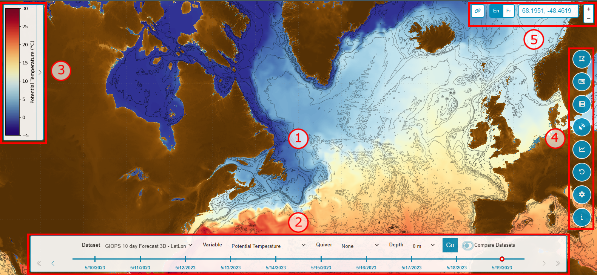

### 1. Main Map

The main map is the most prominent way to visualize oceangraphic forecast models in the Ocean Navigator. The default view is centered on the North-West Atlantic but users can pan over map clicking and dragging at any point. Users can also zoom in or out using their mouse wheel, laptop touchpad, or by using the zoom buttons present in the [Additional Options](#5-additional-options) area.

The main map is highly customizeable and users are given the ability to change the map projection, basemap layers, bathymetry, and more. See [Changing Map Settings](#changing-map-settings-) for more details.

### 2. Dataset Selection Panel

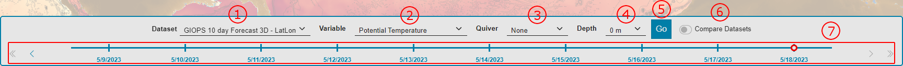

The dataset selection panel allows users to view datasets from the Ocean Navigator's data catalog on the main map. There are several menus that users can use to modify the data presented. Once the user has selected a data product and the relevant parameters they must click the _Go_ button to display the data on the main map. The data set selection menus are described in detail below.

1. Dataset Selector

   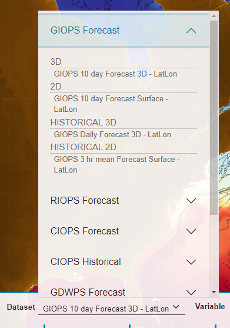

   The dataset drop down allows users to select data from one of the many forecast models available in the Ocean Navigator. Within the dataset dropdown menu data is first grouped by forecast then other relevant details such as dimensionality, time range, and climatologies.

2. Variable Selector

   Allows users to choose a varaible from the currently selected dataset.

3. Quiver Selector

   Users can display vector variables as quiver arrows drawn over the global map view by selecting a variable from the quiver dropdown menu.

   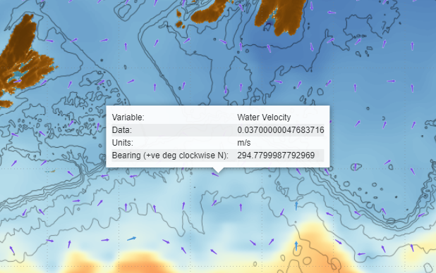

4. Depth Selector

   This dropdown menu allows the user to change the depth level of the currently selected dataset. The highest level is selected by default and the selector will not apear for two dimensional datasets.

5. Compare Datasets Switch

   This switch allows users to display two datasets simultaneous and make comparison line and area plots between the two. See [Comparing Datasets](#Comparing-Datasets) for more details.

6. Timestamp Slider
   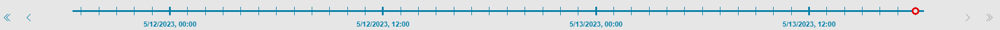

   Users can select the model forecast time on the main map using the _timestamp slider_. The currently selected time is indicated by the slider thumb 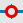.

   To select a new timestamp users can click on any tick along the timestamp slider or select an adjacent timestamp using the previous and next buttons located on each end of the slider .

   Due to size contraints the the timeslider only displays labels for major ticks at 00:00 and 12:00 for hourly datasets but a tooltip will appear over the minor ticks indicating their time. For larger datasets with more than 48 available timestamps the  buttons will cycle though groups of timestamps.

7. Go Button

   The _Go Button_ is used to enact the changes that the user has made through the menus above.

### 3. Data Scale Viewer

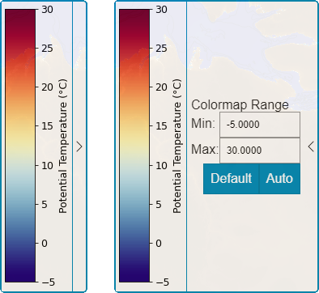

The Data Scale Viewer displays the colormap scale of the currenly displayed variable. Clicking on the data scale viewer will reveal the _Colormap Range_ selector. Here users can adjust the maximum and minimum values of the current colormap by entering new values or clicking the _Auto_ button which will scale the colormap to the data range within the area currently visible on the map. Clicking _Default_ will restore the original colormap range.

### 4. Navigator Map Tools

#### Draw Point Coordinates 

Clicking this button enters drawing mode and the Navigator's drawing options are displayed. The drawing options provide buttons to change the plot type (point, line, and area), undo a point, clear the map, and plot the coordinates added by the user. Once points have been added to the map their locations can also be modified using the [Enter Point Coordinates window](#enter-point-coordinates). For more details on drawing coordinates and plotting see [Selecting Coordinates and Creating Plots with the _Draw Point Coordinates_ Tool](#selecting-coordinates-and-creating-plots-with-the-draw-point-coordinates-tool).

#### Enter Point Coordinates 

Selecting this option displays the _Enter Point Coordinates window_. This feature allows users to enter the exact location of points of interest and plot data at those locations. Users also have the option of importing point coordinates from a CSV file. Like the _Draw Point Coordinates_ tool users can select from a variety of plot types and plotting that data. Any points present on the map, whether they have been previous entered via this window, imported from a CSV, or drawn on the map, can be modified in this window. See [Selecting Coordinates and Creating Plots with the _Enter Point Coordinates_ Tool](#selecting-coordinates-and-creating-plots-with-the-enter-point-coordinates-tool) section for more information.

#### Preset Features 

The Ocean Navigator also provides users with a number of preset points, line, and areas that may be of interest to users. Clicking on this button will present the user with a menu where they can select from a variety of points of interest which can added to the map. Once on the map any of these features can be plotted by clicking on them. Note that selecting any of these options will remove all other points of interest from the map.

#### Observations 

The _Observations_ button allows users to access the Ocean Navigator's observations database. When clicked the Observation options which gives the user a number of options for selecting observations or displaying class4 data. For a more detailed descrition of these options see [Viewing Observation and Class4 Data](#viewing-observation-and-class4-data).

#### Plot 

The _Plot_ button behavior is dependent on the data displayed on the map. For user selected point, lines, or areas clicking this button will open the appropriate [plot window](#ocean-navigator-plot-windows). In the event that multiple points were selected the resulting plot will contain all of them. For preset features, observaitons, and class4 points clicking this button will open a plot window for the most resecntly selected feature.

#### Reset Map 

As implied, the _Reset Map_ button removes all features from the map.

#### Settings 

This button will open the [settings window](#changing-map-settings) where users can modify the main map.

#### Info/Help 

Clicking this button opens the _Info/Help_ window where users can find dataset metadata, variable definitions, and help documents such as this one.

### 5. Additional Options

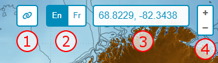

1. Get link Button

   This button opens the _Share Link_ window. Here, users can generate a link to the current state of the Ocean Navigator and share it with others. When accessing the application through this link the current dataset options will be restored.

2. Language Selector

   Allows users to toggle between English and French

3. Cursor Coordinates

   Displays the current latitude/longitude cooridnates of the mouse cursor.

4. Zoom Buttons

   These buttons can be used to change the zoom level of the main map.

# Ocean Navigator Plot Windows

Users can produce a number of plot types from points of interest within the Ocean Navigator. Each plot includes basic statistics for the data presented. These plotters are acessed through the following windows:

## Point

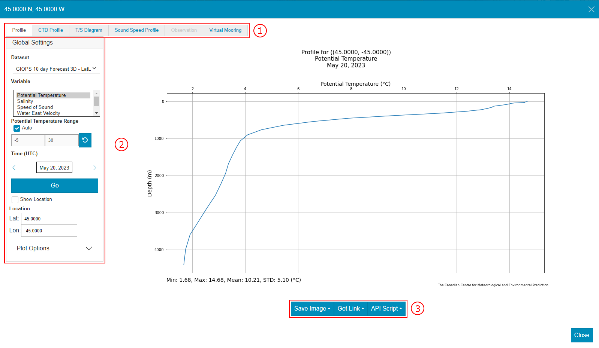

The _Point_ window contains a number of plot types appropriate for extracting data from singular coordinates.

1. Plot Tabs

   Here users can select from a number of point plotters:

   - **Profile Plot:** This is a plot along the water column at the chosen location(s). This plot is only available for variables with a depth dimension. Multiple variables can be selected from the _Dataset Selector_ by holding the shift key and clicking on the desired variables. See _2. Dataset Selector_ for more information.
   - **CTD Profile:** Similar to the _Profile Plot_ but only displays temperature and salinity data.
   - **T/S Diagram:** A temperature and salitiy diagram for the selected location. Temperature is given on the verital axis and salinity on the horizontal. The figure's depth values are amended to the resulting line.
   - **Sound Speed Profile:** A profile plot for the SOund Speed variable. The horizontal axis ranges from 1410 to 1560 m/s.
   - **Observation:** See [Observation](#observation).
   - **Virtual Mooring:** A timeseries plot of at the chosen location. Users can specify start and end times of the plot but due to resource contraints only 50 timestamps can be displayed at once.

2. Dataset Selector

   Similar to the main map's Dataset Selector. Here users can change the dataset, variable, and other parameters. Depending on the current plot tab selected these options may change. The Profile plotter allows users to select multiple variables to be displayed by holding shift and clicking on the variables of interest. This plot, and the virtual mooring plot also include a range selector that allows the user to modify the dependent variable axis range in the plot. When the Virtual Mooring tab is selected the dataset selector will include a time selector for the start and end times of the plot. The user can also check the _Show Location_ box to display a map of the points withinin the plot. Here they can also chagne the location of the selected point. The _Plot Options_ menu allows users to adjust the plot's size and provide an alternate title.

## Line

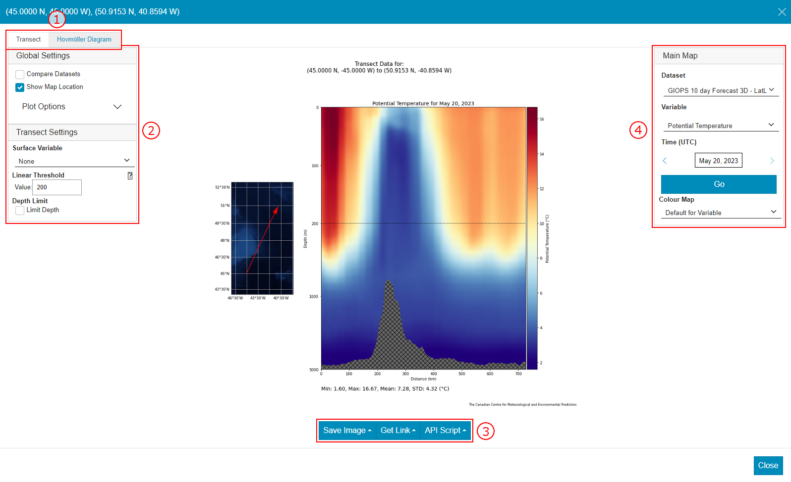

The _Line_ window plots data along a route specified by two or more point coordinates.

1. Plot Tabs

   - **Transect:** A transect plot displays the values along the selected line and water column. The data values are given by the colormap on the right. This plot is only available for variables with depth dimensions.

   - **Hovmöller:** A Hovmöller diagram displays the values along the selected line over a period of time. Again, data values are given by the provided colormap.

2. Plot Settings

   This panel provides the following options for the selected plot.

   - **Compare Datasets:** Checking this option allows users to compare two varaibles from any of the avilable datasets along the selected line. When selected a second Dataset selector becomes avilable to specify the variable to compare to.
   - **Show Map Location:** Check this option to include a map of the selected line in the plot (checked by default).
   - **Plot Options:** Allows users to adjust the plot's size and provide an alternate title.

   If a _transect_ plot is seclected:

   - **Surface Variable:** Users can plot the surface vlues along the transect for any variable listed in the dropdown menu.
   - **Linear Threshold:** This thrshold separates the plot into two sections. The values above the threshold value are plotted on a linear scale while those below are plotted on a logarithmic scale.
   - **Depth Limit:** This option limits the depth of the transect plot.

3. Save Options

   See [Saving Plot Data and Images](#saving-plot-images-and-data).

4. Dataset Selector

   Similar to the main map's Dataset Selector. Here users can change the dataset, variable and other parameters. if _Compare Datasets_ is checked then a second dataset selector will become available. This dataset selector also allows users to change the colormap of the plotted data.

## Area

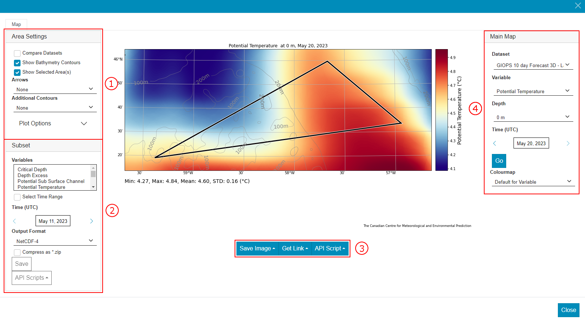

The _Area_ window plots data within a polygon specified by three or more point coordinates.

1. Area Settings

   This panel provides the following options for the selected plot.

   - **Compare Datasets:** Checking this option allows users to compare two varaibles from any of the avilable datasets along the selected line. When selected a second Dataset selector becomes avilable to specify the variable to compare to.
   - **Show Bathymetry Contours:** This option adds bathymetry contours to the area plot (checked by default)
   - **Show Selected Areas:** Checkbox indicated whther to include the selected area in the plot (checked by default).
   - **Arrows Menu:** Selecting a variable from this menu adds its quiver arrows to the area plot.
   - **Additional Contours:** Selecting a variable from this menu adds its isolines to the plot.
   - **Plot Options:** Allows users to adjust the plot's size and provide an alternate title.

2. Subset Panel

   The subset panel allows users to extract data from the plotted area and download in a number of NetCDF file formats.

   - **Variables:** Users can select one or more varaibles to add to the NetCDF subset product from this menu. To select multiple variables hold the shift key while making your selection.
   - **Select Time Range:** Checking this box will allow users to create a subset over a time range.
   - **Time Selector:** Specify the timestamp for the subset data. If a time range is selected two selectors will allow users to pick the start and end times.
   - **Output Format Dropdown:** Users can chose from a number of NetCDF formats for the output.
   - **Compress as \*.zip:** Checking this box will compress the output file in a .zip archive.
   - **Save:** Once all of the above ahve been selected click this button so save the subset product.
   - **API Scripts:** Users can download API scripts to retrieve the selected subset data in _R_ or _Python_.

3. Save Options

   See [Saving Plot Images and Data](#saving-plot-images-and-data).

4. Dataset Selector

   Similar to the main map's Dataset Selector. Here users can change the dataset, variable and other parameters. if _Compare Datasets_ is checked then a second dataset selector will become available. This dataset selector also allows users to change the colormap of the plotted data.

## Observation

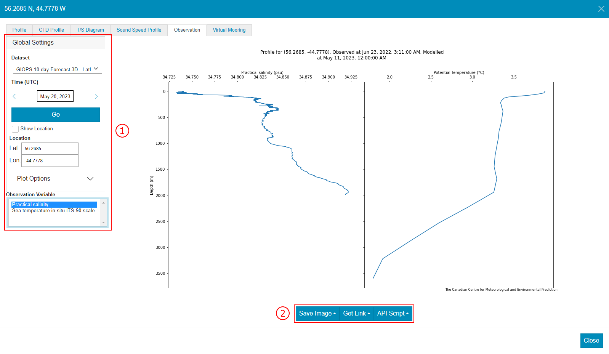

The _Observation_ window allows users to compare a selected observation to model data. The observation window will contain two figures with the observtiondata on the left and model data on the right.

1. Dataset Selector

   A limited dataset selector where users can change the dataset and its timestamp, and the location of the point compared to the observation. Since the selected dataset may not contain data from the same time as the observation the most recent timestamp is selected by default. This dataset selector also includes an _Observation Variables_ list where users can choose which observed metric to compare to the model.

2. Save Options

   See [Saving Plot Images and Data](#saving-plot-images-and-data).

## Class4

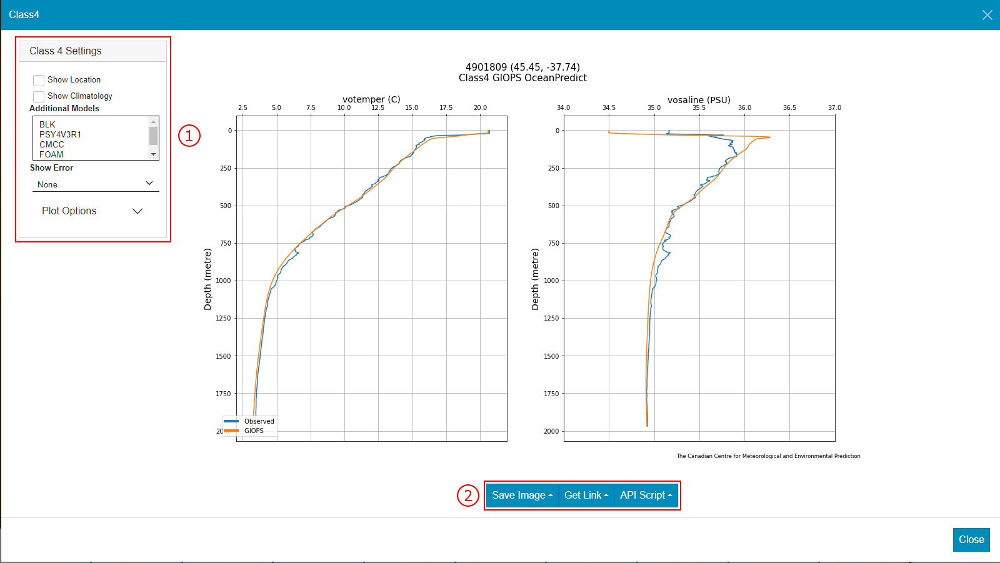

Class4 metrics are one of a number of validation tools used to validate GIOPS or RIOPS model forecasts by comparing temperature and salinity predictions to observations of the same quantites.

1. Class4 Settings

   - **Show Location:** Check this option to include a map of the selected line in the plot.
   - **Show Climatology:** Check this option to include climatology data in the figures.
   - **Additional Models:** Users can also add other models to the figures to comparison. To add multiple hold the shift key while selecting models.
   - **Show Error:** Check this option to view the error of the models compared to the observation.
   - **Plot Options:** Allows users to adjust the plot's size and provide an alternate title.

2. Save Options

   See [Saving Plot Images and Data](#saving-plot-images-and-data).

## Saving Plot Images and Data

The are three sets of options avaialble to users for extracting the plotted data:

**Save Image**

Users can save the plot in one of many common image formats including _png, jpg, svg_, and others. The _CSV/ODV_ options allow the user to download the raw data in either format. Lastly, users can download just the statistics using the _Statistics (csv)_ option.

**Get Link**

Here users can generate links to the plotted data. The _Web_ option will produce a link that will open the Ocean Navigator in its current state with the plot window opened and plot displayed. The _Image_ option creates a direct link to the image only.

**API Script**

Users can generate API scripts in either _R_ or _Python_ that will fetch the plot. The _PLOT_ option will retrieve the image in _png_ format while the _csv_ option will produce a _csv_ file containing the plot data. These options can be futher developed to include other Ocean Navigator features. See the [API Documentation](https://navigator.oceansdata.ca/docs) for further information on how to interact with the API.

# Using the Ocean Navigator

## Selecting Coordinates and Creating Plots with the _Draw Point Coordinates_ Tool

To slect points of interest on the main map first clicking on the _Draw Point Coordinates_ button  to open the drawing options:

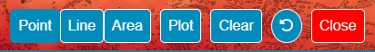

These options include:

- _Point_, _Line_, and _Area_ toggle:

  These buttons are used to toggle between the drawn feature type.
  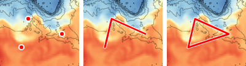

- _Plot_ button:

  Clicking this button will open the appropriate plotting window (see [Ocean Navigator Plot Windows](#ocean-navigator-plot-windows)). This button is only response if enough points have been drawn for the selected feature type; 1 for point, 2 for line, and 3 for area plots.

- _Clear_ button:

  This button will remove all features from the map.

- _Undo_ button:

  This button removes the last-drawn point.

- _Close_ button:

  Closes the plot options.

To modify the location of one or more point users can click the _Enter Point Coordinates_ button  to modify point locations.

Once the desired points have been added and feature type selected, click the _Plot_ button to view the selected data.

## Selecting Coordinates and Creating Plots with the _Enter Point Coordinates_ Tool

Users can precisely select points of interest using the _Enter Point Coordinates_ tool. To open the _Enter Coordinates_ window first click on the _Enter Point Coordinates_ button 

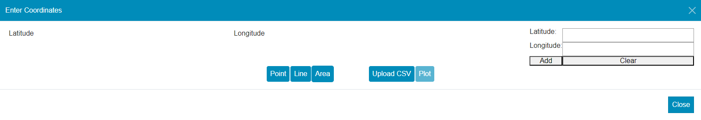

The left side of the window contains a table for the coordinates enetered. If any points have been selected, whether through this window or other means, the table will already be populated.

To add new coordinates to the table enter latitude and longitude values in the form to the right and click _Add_. The _Clear_ button will remove all points from the table.

Users can also import data from _csv_files by clicking on the \_Uploatd CSV_ button. The file must begin with a header containing "latitude" and "longitude" to indicate which columns hold these values.

Users can click on values in the table to make futher changes, or remove them completely by clicking the _x_ icon on the right of their respective rows.

Once satisfied with the chosen coordinates users can select a plot type from the _Point/Line/Area_ toggle and click the plot button to open the relevant [Plot Window](#ocean-navigator-plot-windows).

## Creating Plots via the _Preset Features_ Menu

The Ocean Navigator also has a number of preset features that may be of interest to users. To view the list of the preset features click on the \_Preset Features_button 

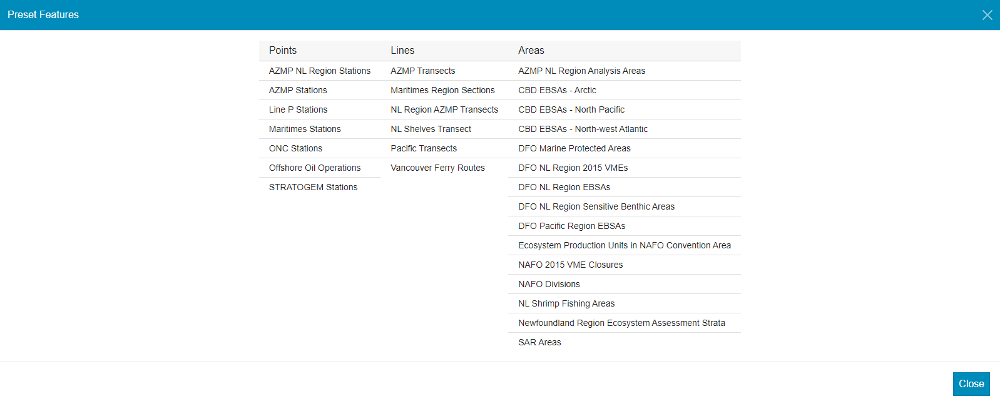

Features are categorizaed into lists of Point, Line, or Area features. Click on any itsm from the list to add it to the main map. Note that any other features will be removed.

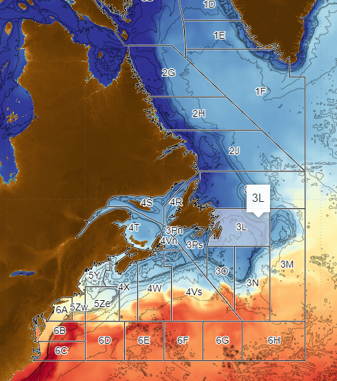

Once features are added to the map users can plot their point/line/area data by clicking on them.

## Viewing Observation and Class4 Data

The Ocean Navigator has a variety of observation products available to its users. To
display observation features on the map first click the _Observations_ button . This will open the _Observation Options_ menu:

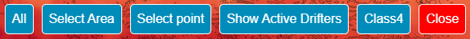

These options are as follows:

- _All:_

  Select this option to view observations without any geographic constraints. This immediately opens the _Select Observations_ window.

- _Select Area:_

  This option allows users to view observations within a chosen area. When clicked the user is promped to draw an area polygon before the _Select Observations_ window is opened.

- _Select Point:_

  The _Select Point_ option allows users to select observation within a radius of a given coordinate. When clicked users will need to click on the desired location on the map to open the _Select Observations_ window.

- _Class4:_

  This option opens the _Class4 Selector_ used to view Class4 data. See [Displaying Class4 Data](#displaying-class4-data).

- _Close:_

  Click this button to close the _Observation Options_ menu.

Once a selection has been made the _Select Observations_ window will open. This window gives users anumber of ways to wuery observation data and view the resulting products.

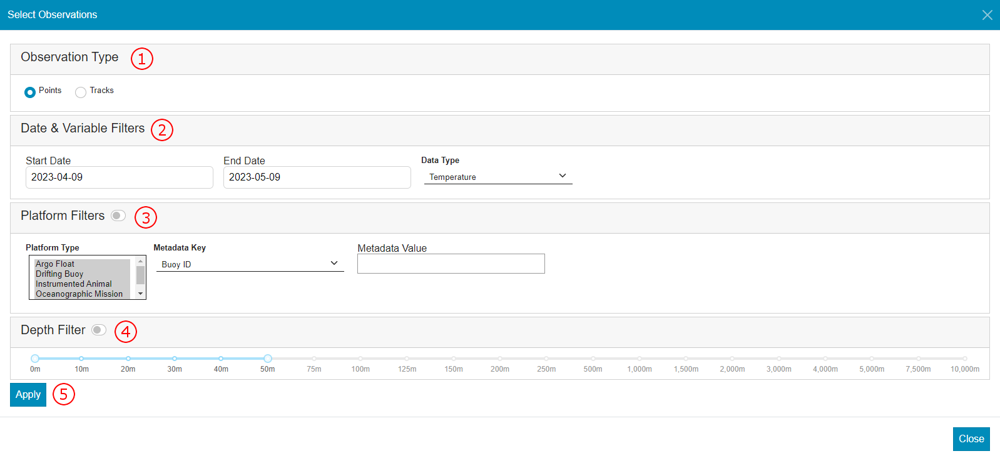

1. Observation Type

   Here users can choose to view the observation product as individual points or tracks on the map. 

2. Date & Variable Filters

  Here users can specify a date range for the resulting observation data and the observed variable.

3. Platform Filters 

  This menu allows users to narrow their observation query to a specific plat form type. From there they can restrict their search to platforms matching a specific Metadata Key such as instrument identification numbers, name of the principal investigator, ship name, and more. These criteria are not applied to the search unless the switch is active.

4. Depth Filter

  This slider can be used to restrict observations to a particular depth range in the water column. Like the _Platform Filters_ this range is not applied unless the switch is active.

5. Apply

  Click _Apply_ to query the observations once all of the selections have been made.

Once the user has completed the steps above the main map will be populated with observation points that meet their selection criteria. 

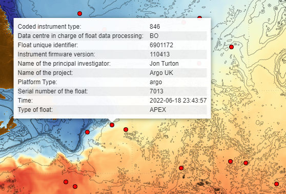

### Displaying Class4 Data

Selecting the Class4 button from the _Observation Options_ opens the _Class4 Selector_. Class4 metrics are one of a number of validation tools used to validate GIOPS or RIOPS model forecasts by comparing temperature and salinity predictions to observations of the same quantites. 

Class4 metrics are available in two categories; _Ocean Predict_, and _RIOPS Assimilated Observations_. _Ocean Predict_ products are Class4 validation products that compare data from the GIOPS forecast model against observations. This product also includes forecasts from other models which can be added to the comparison plots. The _RIOPS Assimilated Observations_ products are similar but only include data from the RIOPS forecast model. 

The _Class4 Selector_ includes a dropdown menu to where users can toggle between to two Class4 product types and a calendar that shows the dates with available data for the selected product.

To add Class4 data to the map select the Class4 product type then a date of interest. The OceanNavigator will then draw the Class4 points on the map. These points are colored according the products RMS error i.e. how well the model fits the observed data. Green points indicate high agreement between the forecasted data and observation while red points indicated poor agreement. 

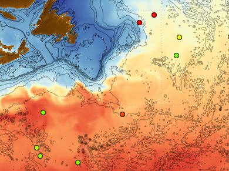

## Comparing Datasets

Checking the compare datasets toggle switch 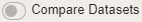
will open the comparison view. The view includes two maps and corresponding Dataset Selector panels. Users can select from any two avialable datasets and make comparisons between them. Any action, such as pan or zoom actions, applied to one will be applied to the other. Feature selection will also apply to both maps and comparison plots will be made where possible. Examples of the comparison view and resulting transect and area plots are given below.

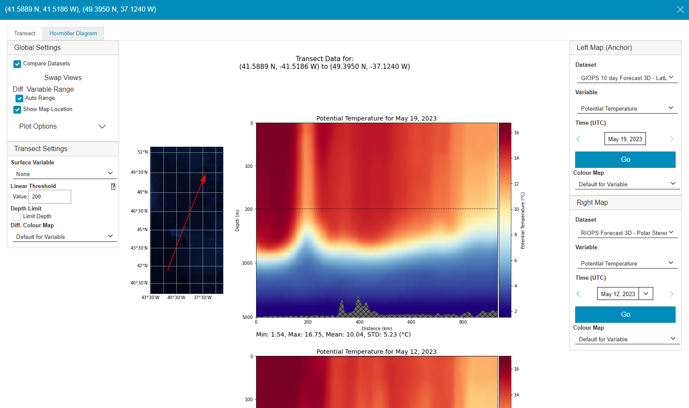

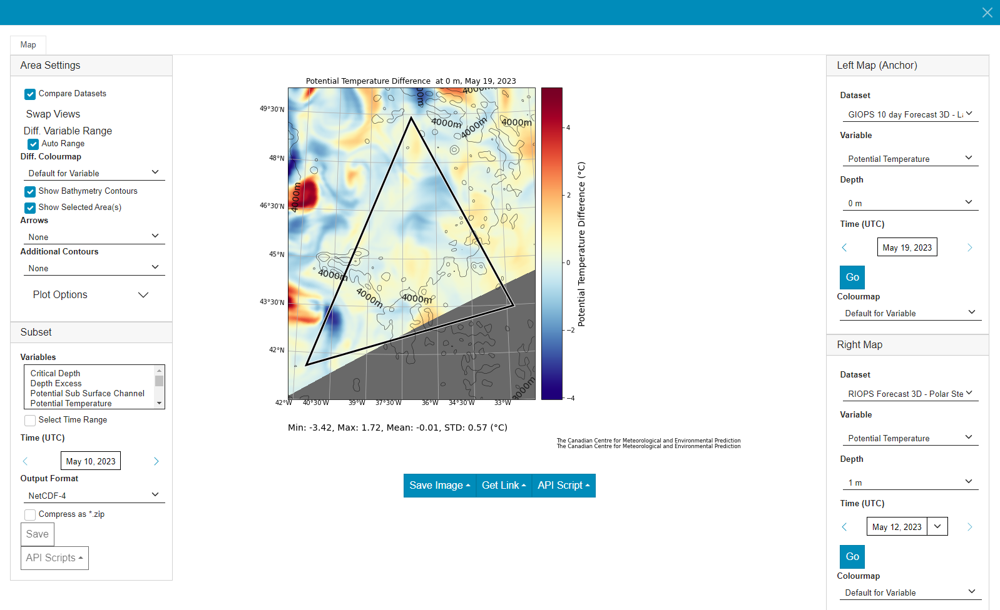

## Changing Map Settings 

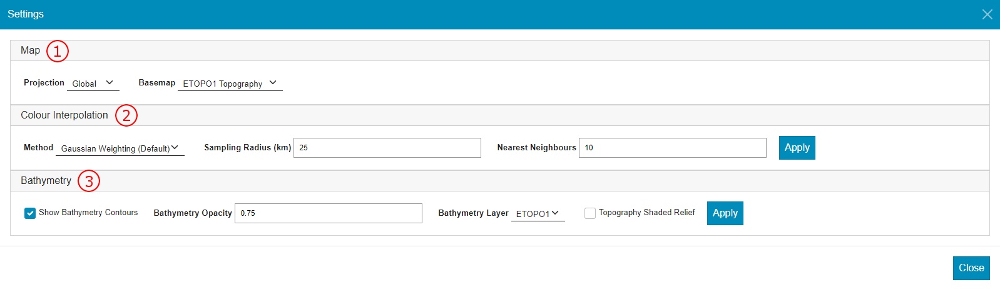

1. Map

   * _Projection:_

     Users can toggle between the Global (default), Arctic, or Antarctic projections.

   * _Basemap:_

     Users can change the topography of the land and underlying bathymetry with this dropdown menu. 

2. Color Interpolation

   Because the model forecast data is discrete and can be relatively sparse interpolation is used to smooth and fill in areas on the maps data tiles.

   * _Method:_

      Users can change the interpolation method applied to the data tiles. _Gaussian Weighting_ is used by default but other methods, such as Bilinear and Nearest Neighbour interpolation, can be used instead.

   * _Sampling Radius (km):_

     The distance from each point used in the interpolation calculation.

   * _Nearest Neighbours:_

     The number of neightbours to use in the interpolation calculation.

   * _Apply:_

     Click this button to apply interpolation changes to the map.

3. Bathymetry

   * _Show Bathymetry Contours:_

     This checkbox allows users to toggle the bathymetry contours drawn on the main map.

   * _Bathymetry Opacity:_

     Here users can adjust the opacity of the bathymetry contours.

   * _Bathymetry Layer:_

      This menu will allow users to select between bathymetry sources. At the momenty only _ETOP01_ is available.

   * _Topography Shaded Relief:_

       Check this box to add shaded relief to the basemap layer.

   * _Apply:_

     Click this button to apply bathymetry changes to the map.