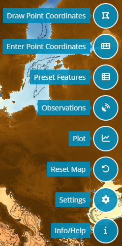

# Ocean Navigator Overview

The Ocean Navigator is a data visualization tool which aims to provide users access to ocean environment prediction products and in-situ observation data.

### 1. Main Map

### 2. Dataset Selection Panel

1. Dataset Selector
this allows for a selection of the different data sets, some datasets contain different types of data and some have recorded the same data in different ways.
2. Variable Selector
3. Quiver Selector
4. Depth Selector
5. Compare Datasets Switch
6. Timestamp Slider
7. Go Button

### 3. Data Scale Viewer

### 4. Navigator Tools
|||
||Draw Point Coordinates|
||Enter Point Coordinates|
||Preset Features|
||Observations|
||Plot|
||Reset Map|
||Settings|
||Info/Help|

### 5. Additional Options

# Using the Ocean Navigator

## Navigating Data Displayed on the _Main Map_

## Selecting Coordinates and Creating Plots with the _Draw Point Coordinates_ Tool 

## Selecting Coordinates and Creating Plots with the _Enter Point Coordinates_ Tool 

 

## Creating Plots via the _Preset Features_ Menu 

 

## Viewing Observation and Class4 Data 

1.
2.
3.
4.
5.

## Comparing Datasets

Checking the compare datasets box will bring up a side by side view of the data set. It will also provide settings in the left side bar for each view. Each view can be changed independently by setting the values in the corresponding settings box (ie left or right view). In addition, the plotting features, explained below in the Drawing section, will provide extra information when comparing datasets, most notably a difference plot will be shown when comparing variables that are similar.

## Changing the Map Settings 

1. Map

..* Projection
...the global projection will be the view that most users will need, however for users that want to view the north or south poles those options exist in the drop down here.

* Basemap

2. Color Interpolation

3. Bathymetry

